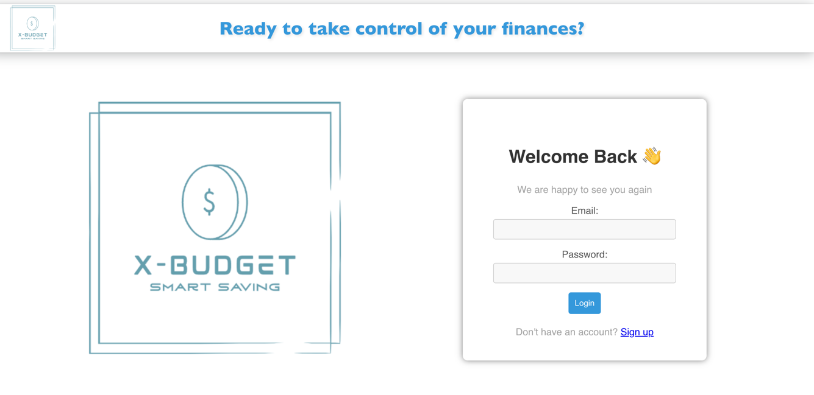
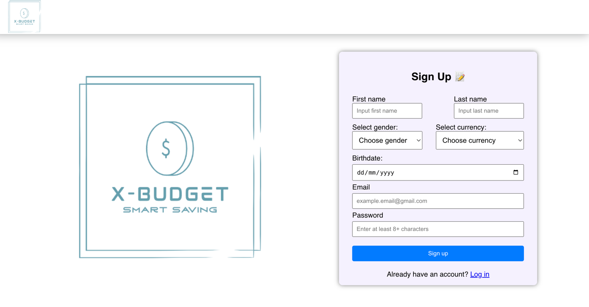
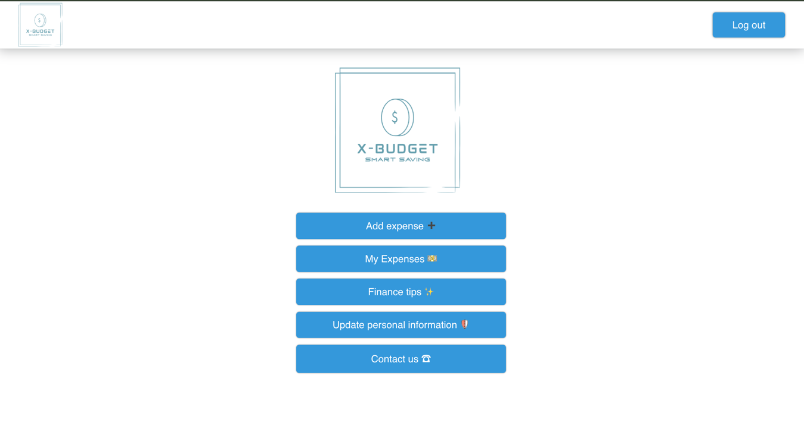
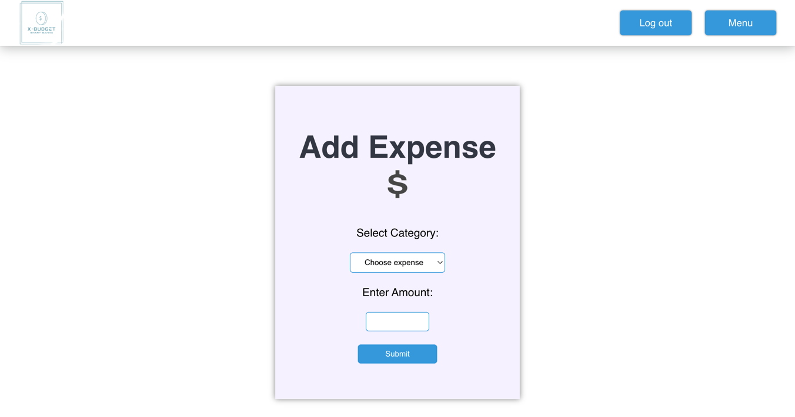
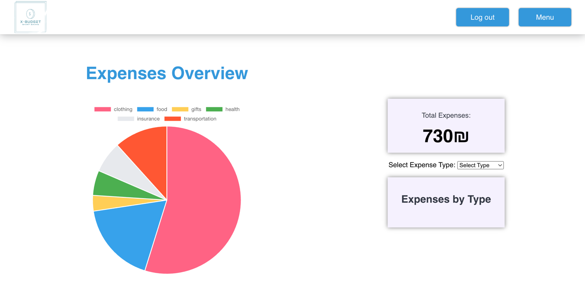
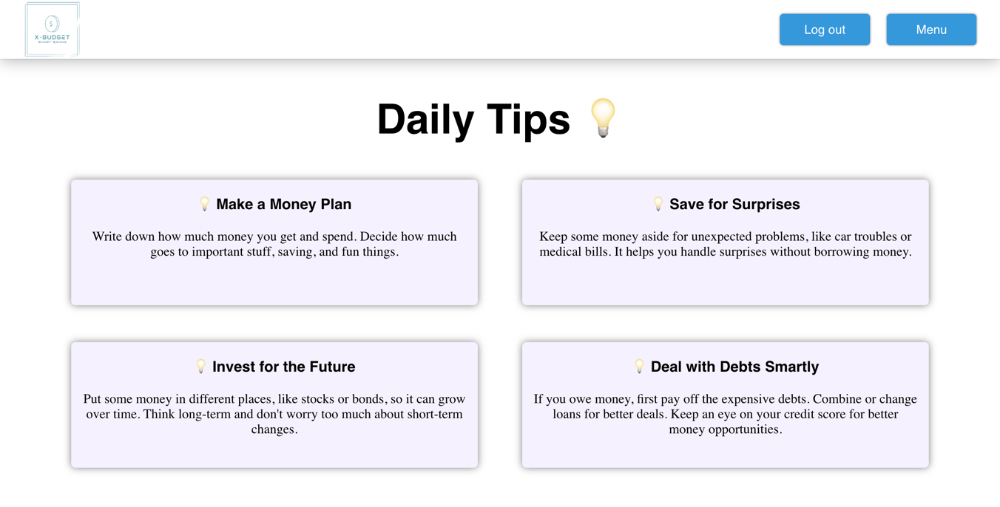
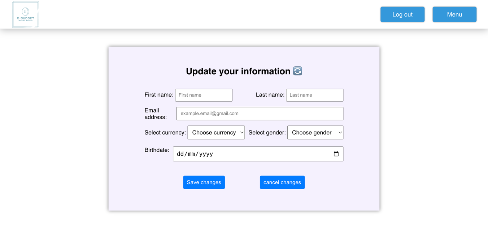
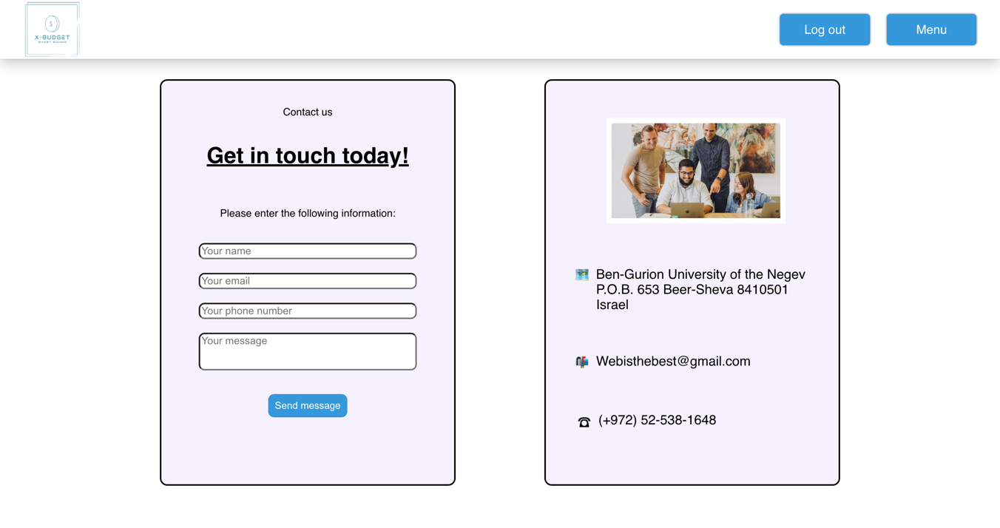

# x-budget


## Description
This project is a web application that allows users to manage their expenses. The application is built using HTML, CSS, JavaScript.

## Visit our website online: [x-budget](http://david-adam-1317051721.us-east-2.elb.amazonaws.com/) !!!

## Technologies
* [Python](https://www.python.org/)
* [Flask](https://flask.palletsprojects.com/en/2.0.x/)
* [mongoDB](https://www.mongodb.com/)
* [HTML](https://developer.mozilla.org/en-US/docs/Web/HTML)
* [CSS](https://developer.mozilla.org/en-US/docs/Web/CSS)
* [JavaScript](https://developer.mozilla.org/en-US/docs/Web/JavaScript)

## Installation

### Clone the repository
```shell
git clone 'repository_url'
```

### Install dependencies
```shell
pip install -r requirements.txt
```

### Add the .env file
```shell
FLASK_ENV = development
DEBUG = TRUE
FLASK_RUN_HOST = your_host
FLASK_RUN_PORT = your_port

SECRET_KEY = your_secret_key

DB_URI = db_uri
```

### Run the application
```shell
flask run
```

## Usage
**x-budget** is a web application that allows users to manage their expenses. The application contains the following pages:

### **Login page**:
The login page is the first page the user will see when he enters the site. It contains two input fields, one for the email and one for the password. 
The user can also click on the "sing up" button to go to the registration page.



### **Registration page**:
The registration page contains input fields for the user's personal details, such as name, email, password, and more. 
The user can also click on the "login" button to go to the login page.



### **Main menu**:
The main menu is the first screen the user will see after logging in, it contains the following options:
* **Add expense**: The add expense screen.
* **My expenses**: see all the expenses of the user.
* **Finance tips**: A page with general tips for managing expenses.
* **Update personal information**: A page where the user can update his personal details.
* **Contact us**: A page with contact details for the site's support.



### **Add expense**:
The add expense page contains input fields for the user to enter the expense details, such as the amount, category, and date.




### **My expenses**:
The my expenses page contains a table with all the expenses of the user. The user can also delete an expense by clicking on the delete button.



### **Finance tips**:
The finance tips page contains general tips for managing expenses.



### **Update personal information**:
The update personal information page contains input fields for the user to update his personal details, such as name, email, and password.



### **Contact us**:
The contact us page contains the contact details of the site's support.



## Site Navigation
You start by logging in or registering. After that, you can navigate through the site using the main menu.
Navigate to the 'add expense' page to add a new expense. 
Navigate to the 'my expenses' page to see all your expenses.
Navigate to the 'finance tips' page to see general tips for managing expenses.
Navigate to the 'update personal information' page to update your personal details.
Navigate to the 'contact us' page to see the contact details of the site's support.